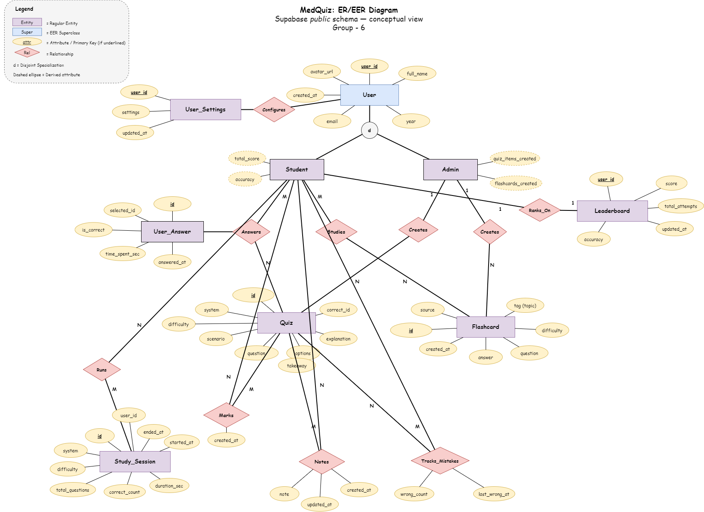
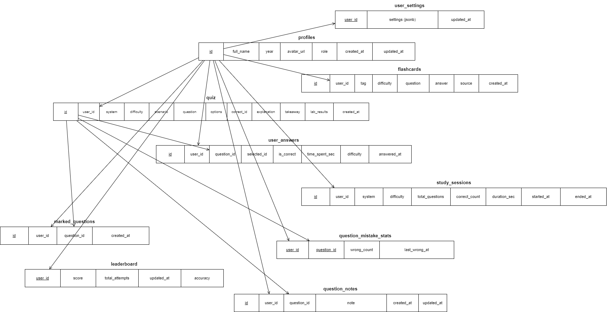

# CSE370 Project Submission - MedKotha - Group 6

This repository contains our project idea submission and the ER/EER and schema diagrams for our CSE370 project. The runnable source code lives in the [`project/`](./project/) folder (frontend, SQL, and related assets).

## Files in Repository

* **Project Idea Submission (PDF):** [Group_6_Project_Idea_Submission.pdf](./Group_6_Project_Idea_Submission.pdf)
* **Application source:** [`project/`](./project/) — MedKotha web app and database scripts
* **ER/EER Diagram File:** [medquiz_ER_diagram.drawio](./medquiz_ER_diagram.drawio)
* **Schema Diagram File:** [medquiz_schema_diagram.drawio](./medquiz_schema_diagram.drawio)
* **Diagram exports (V3 PNG):** [medquiz_ER_diagramV3.png](./images/medquiz_ER_diagramV3.png), [medquiz_schema_diagramV3.png](./images/medquiz_schema_diagramV3.png)

## ER/EER Diagram (V3)

## Schema Diagram (V3)

